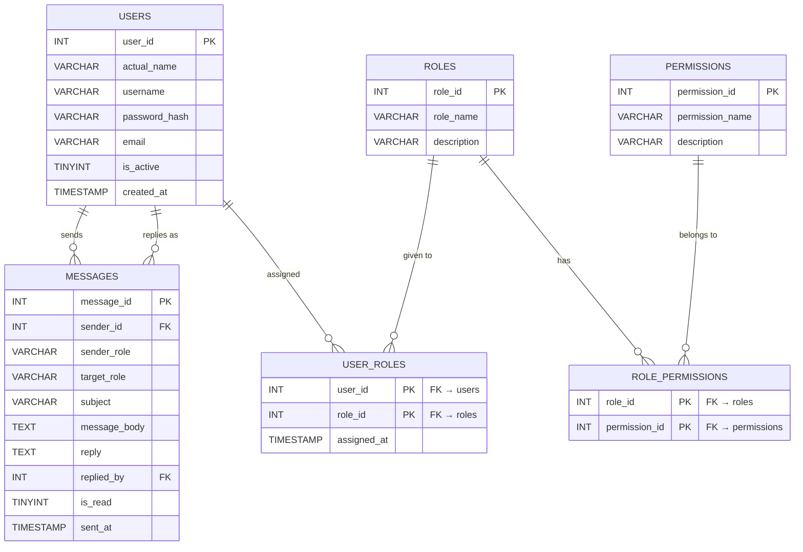

# 🛡️ CipherShield - Admin Login System with RBAC

> **Course:** CSE250 Database Management Systems
>
> **University:** Ahmedabad University (SEAS) | **Semester:** Winter 2026
>
> **Faculty:** Susanta Tewari
>
> **Team:** Yug Bangoriya · Jawal Agrawal · Kamya Shah

---

## ❓ What is CipherShield?

CipherShield is a **Role-Based Access Control (RBAC) Login System** built as a database management systems project. The core idea is straightforward - users register, log in, and are shown a personalised dashboard based on their assigned role. What they can see and do on that dashboard is entirely controlled by the role stored in the database.

The system solves a real-world problem: **how do you make sure different users in the same application only see what they are supposed to see?** CipherShield answers this by storing roles and permissions in a relational database and enforcing them on every request through the backend.

---

## 🌐 Live Hosted Website

Website   | https://ciphershield-3qq1.onrender.com/login.html                   

---

## 🛠️ Tech Stack

| Layer          | Technology                  |
|----------------|-----------------------------|
| Database       | MariaDB                     |
| Backend        | Node.js with Express        |
| Frontend       | Plain HTML + CSS (no frameworks) |
| Security       | bcrypt (password hashing)   |
| IDE            | IntelliJ IDEA               |
| Version Control | GitHub                     |

---

## 🛂 The 3 Roles and What They Can Do

The entire system is built around three roles. Every user has exactly one role, and that role determines everything they see on the dashboard.

| Feature / Permission      | SuperAdmin | Admin | Viewer |
|---------------------------|:----------:|:-----:|:------:|
| View dashboard            | ✅ | ✅ | ✅ |
| View own profile card     | ✅ | ✅ | ✅ |
| View quick stats panel    | ✅ | ✅ | ❌ |
| View all users list       | ✅ | ✅ (read-only) | ❌ |
| Change any user's role    | ✅ | ❌ | ❌ |
| View system version info  | ✅ | ❌ | ❌ |
| View all messages (system-wide) | ✅ | ❌ | ❌ |
| Receive & reply to messages from Viewers | ✅ | ✅ | ❌ |
| Escalate issues to SuperAdmin | ❌ | ✅ | ❌ |
| Send support messages to Admin | ❌ | ❌ | ✅ |
| View own message history  | ❌ | ❌ | ✅ |

> SuperAdmin and Admin accounts are created manually via SQL insert. All new registrations are automatically assigned the Viewer role.

---

## 🏗️ Database Structure (6 Tables)

| Table              | Purpose                                                                       |
|--------------------|-------------------------------------------------------------------------------|
| `users`            | Stores all registered users - name, username, email, bcrypt-hashed password   |
| `roles`            | Stores the three roles: SuperAdmin, Admin, Viewer                             |
| `permissions`      | Stores individual permission names (e.g., `edit_roles`, `view_system_info`)   |
| `role_permissions` | Join table - links which permissions belong to which role (many-to-many)  |
| `user_roles`       | Join table - links which role is assigned to which user                   |
| `messages`         | Stores the internal messaging system - sender, target role, reply, read status |

### ER Diagram



---

## 📝 Key SQL Queries

### Query 1 - Get all users with their assigned role name

```sql
SELECT
    users.user_id,
    users.actual_name,
    users.username,
    users.email,
    roles.role_name
FROM users
LEFT JOIN user_roles ON users.user_id    = user_roles.user_id
LEFT JOIN roles      ON user_roles.role_id = roles.role_id
ORDER BY users.created_at DESC;
```

---

### Query 2 - Get all permissions assigned to a specific role

```sql
SELECT permissions.permission_name
FROM role_permissions
JOIN permissions ON role_permissions.permission_id = permissions.permission_id
WHERE role_permissions.role_id = ?;
```

---

## 🔙 Backend API Routes

All routes are in a single file - `Server.js` - built using Node.js and Express.

| Method | Route             | Who Uses It             | What It Does                                                |
|--------|-------------------|-------------------------|-------------------------------------------------------------|
| POST   | `/register`       | Anyone                  | Creates a new user; hashes password with bcrypt; auto-assigns Viewer role |
| POST   | `/login`          | Anyone                  | Finds user by username; compares password with bcrypt; returns user + role + permissions |
| GET    | `/users`          | SuperAdmin, Admin       | Returns all users with their role names                     |
| POST   | `/changerole`     | SuperAdmin              | Updates a user's role in `user_roles`                       |
| GET    | `/version`        | SuperAdmin              | Returns current Node.js and MariaDB version numbers         |
| GET    | `/stats`          | SuperAdmin, Admin       | Returns total users, per-role counts, total permissions     |
| POST   | `/sendmessage`    | Viewer, Admin           | Inserts a new message into the `messages` table             |
| GET    | `/inbox`          | All roles               | Returns messages filtered by the requesting user's role     |
| POST   | `/reply`          | Admin, SuperAdmin       | Updates a message row with a reply and marks it as read     |
| POST   | `/forgotpassword` | Anyone                  | Checks if a username or email exists in the database        |
| POST   | `/resetpassword`  | Anyone                  | Hashes a new password and updates it in the database        |
| GET    | `/test`           | Developer               | Health check - confirms server and database are running     |

---

## 🖥️ Frontend Pages

All pages follow the same visual theme: **black background (`#020101`) with burnt orange (`#b7410e`) accents**, a glowing card UI, and entrance animations.

### login.html
- Username and password fields with a show/hide toggle
- Math CAPTCHA (randomly generated addition/subtraction question, refreshes on wrong answer)
- Redirects to dashboard on successful login

### register.html
- All registration fields (name, username, email, password)
- Live **password strength bar** with a 5-rule checklist (12+ characters, uppercase, lowercase, number, special character)
- Confirm password field with a live match indicator
- Math CAPTCHA
- Warning reminding the user to save their username/email for password recovery

### dashboard.html
- **Profile Card** - shows avatar (initials), name, username, email, role, and permission list (visible to all roles)
- **Quick Stats Panel** - total users, per-role counts, total permissions (SuperAdmin and Admin only)
- **SuperAdmin view** - version info, full user table with role changer, all messages in the system
- **Admin view** - read-only user list, support inbox with reply forms, escalate-to-SuperAdmin form
- **Viewer view** - send a support message form, own message history with any replies received

### forgot-password.html
- Step 1: Enter username or email to find the account
- Step 2: Set a new password with strength bar and confirm match indicator

---

## 🔐 Security Features

| Feature                         | Implementation Detail                                           |
|---------------------------------|-----------------------------------------------------------------|
| **bcrypt password hashing**     | Passwords are hashed at `SALT_ROUNDS = 10` before storing. The original password is never saved anywhere. |
| **Secure login check**          | Login finds the user by username first, then uses `bcrypt.compare()` to verify the password - the hash is never reversed or decrypted. |
| **Math CAPTCHA**                | Randomly generated on both login and register pages to block automated bot submissions. Refreshes on a wrong answer. |
| **Password strength checker**   | Enforces 5 rules before allowing registration or password reset. |
| **Confirm password field**      | Present on register and reset password pages to prevent typos. |
| **Role-based access control**   | Enforced on the backend - each route checks the user's role before returning any data. |
| **Session management**          | User session is stored in `sessionStorage` (cleared automatically when the browser tab is closed or on logout). |

---

## ▶️ How to Run Locally

This project can run entirely on your local machine too. No external hosting or cloud service is required.

**Prerequisites:** Node.js installed, MariaDB running on `localhost:3306`

**Step 1 - Set up the database**

Open DataGrip or any MariaDB client and run these two SQL files in order:
1. `creating_tables.sql` — creates the database and all 6 tables
2. `configuring database permissions.sql` — inserts roles, permissions, and links them

**Step 2 - Install dependencies**

Open IntelliJ's built-in terminal and run:

```bash
npm install
```

**Step 3 - Start the server**

```bash
node Server.js
```

The server will start at `http://localhost:3000`.

**Step 4 - Open the app**

Go to your browser and open:

```
http://localhost:3000/login.html
```

> To test SuperAdmin or Admin features, insert those users manually into the `users` and `user_roles` tables via SQL (all new registrations auto-get the Viewer role).

---

## 📁 Project Structure

```
.
├── Server.js                             # All backend routes (Node.js + Express)
├── package.json                          # Project dependencies
│
├── login.html                            # Login page with CAPTCHA
├── register.html                         # Register page with strength checker + CAPTCHA
├── dashboard.html                        # Role-aware dashboard (all 3 roles)
├── forgot-password.html                  # Two-step password reset
│
├── creating_tables.sql                   # Database schema — creates all 6 tables
├── configuring database permissions.sql  # Inserts roles, permissions, and links them
└── drop-table.sql                        # Utility — drops all tables (for reset)
```

---

## 👥 Team

| Name          | Enrolment Number                  |
|----------------|-----------------------------|
| Yug Bangoriya       | AU2420014              |
| Jawal Agrawal       | AU2420150              |
| Kamya Shah          | AU2400014              |

---

*CSE250 - Database Management Systems, Ahmedabad University, Winter 2026*
